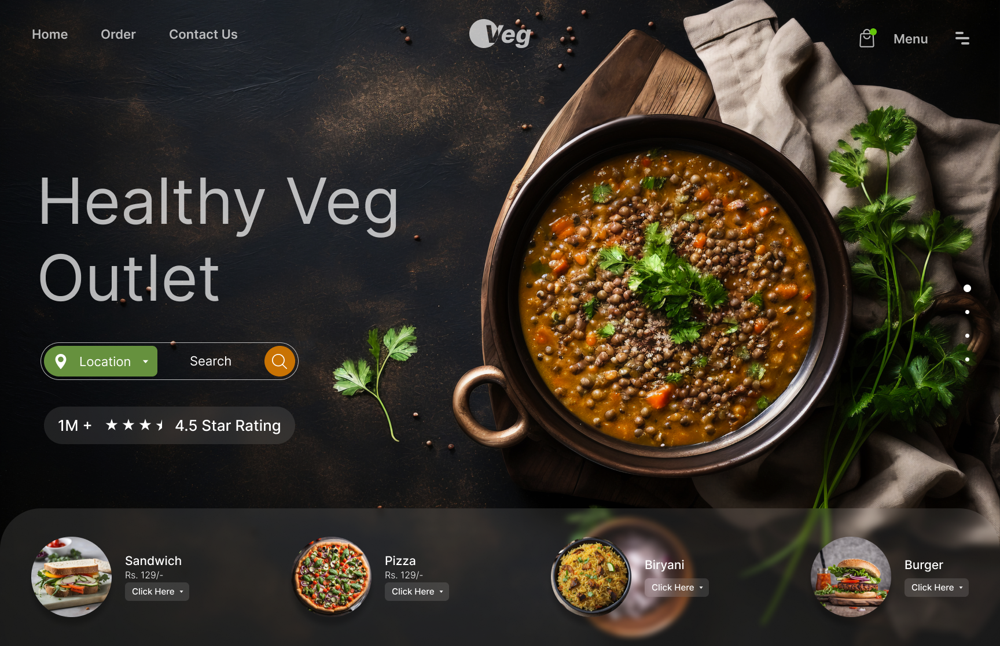

# Veg — Modern & Minimal Hero Restaurant

#

 Este repositorio contiene la implementación técnica de una interfaz de alta fidelidad, traduciendo un diseño conceptual de Figma Community a un entorno funcional utilizando tecnologías modernas de frontend.

- ✨ Modern & Minimal Hero Layouts
- 🎨 Clean Landing Page UI
- 🚀 Figma to Frontend: Hero Sections
- 🥗 Restaurant Landing Page Website

## 🛠️ Tecnologías utilizadas
- Vite
- Vue
- TypeScript
- TailwindCSS
- Figma Community (diseño base)

## 🙌 Créditos
- **Diseño original:** [dsingr](https://www.figma.com/@dsingr) en Figma Community  
- **Archivo de diseño:** [Ver en Figma](https://www.figma.com/community/file/1322126007319335539/restaurant-landing-page-website-design-figma-ui-tutorial-day-77-of-100-day-ui-challenge)  
- **Implementación frontend:** Luis Arteaga(este repositorio)
